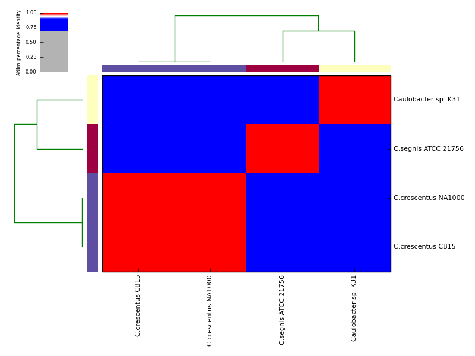
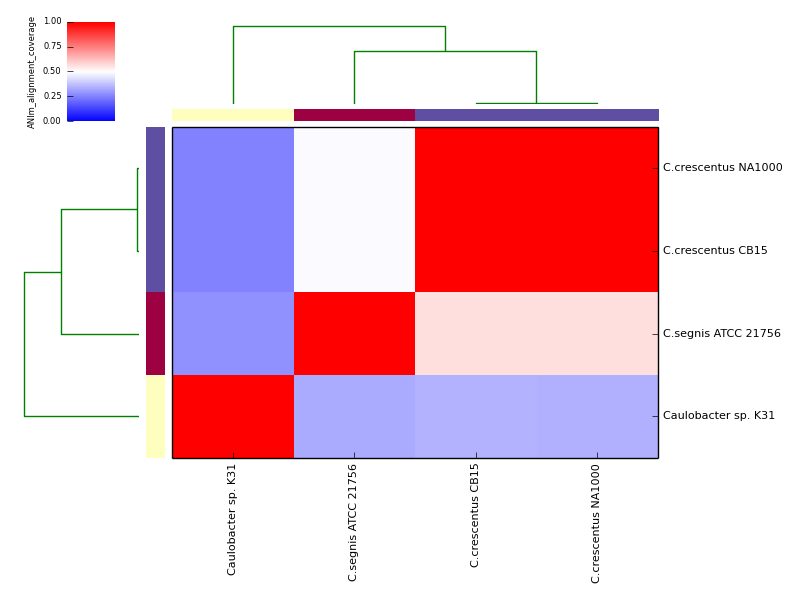
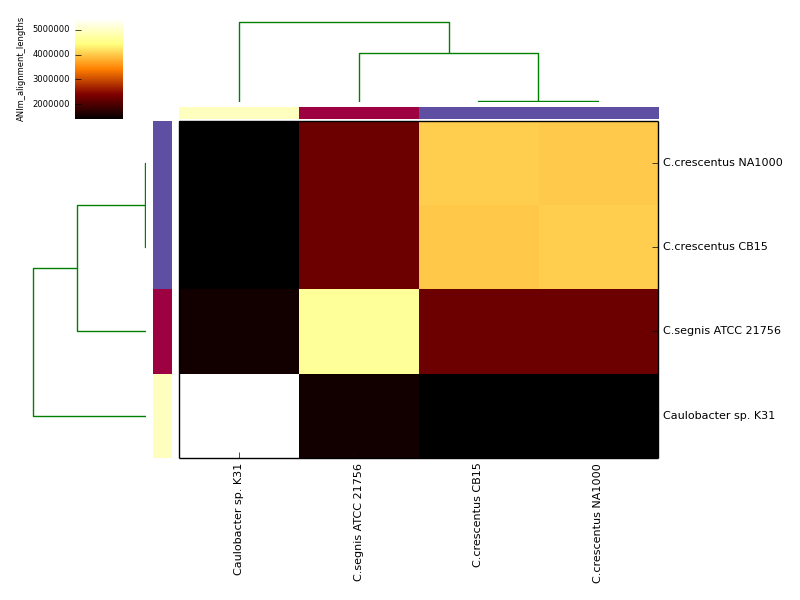
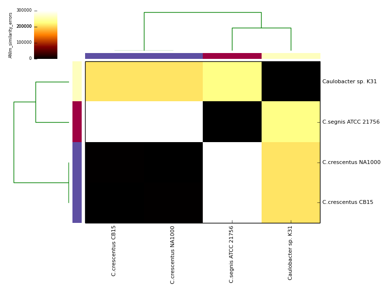

# README.md (pyani)

## Overview
`pyani` is a Python module that provides support for calculating average nucleotide identity (ANI) and related measures for whole genome comparisons, and rendering relevant graphical summary output. Where available, it takes advantage of multicore systems, and can integrate with [SGE/OGE](http://gridscheduler.sourceforge.net/)-type job schedulers for the sequence comparisons.

`pyani` also installs a script: `average_nucleotide_identity.py` that enables command-line ANI analysis.

## Installation

The easiest way to install `pyani` is to use `pip`:

```
pip install pyani
```

From version 0.1.3.2 onwards, this should also install all the required Python package dependencies. Prior to this version (i.e. 0.1.3.1 and earlier), you can acquire these dependencies with `pip -r`, and pointing at `requirements.txt` from this repository:

```
pip install -r requirements.txt
```

## Running `pyani`

### Script: <a name="average_nucleotide_identity.py">`average_nucleotide_identity.py`</a>

The `average_nucleotide_identity.py` script - installed as part of this package - enables straightforward ANI analysis at the command-line, and uses the `pyani` module behind the scenes.

You can get a summary of available command-line options with `average_nucleotide_identity.py -h`

```
$ average_nucleotide_identity.py -h
usage: average_nucleotide_identity.py [-h] [-o OUTDIRNAME] [-i INDIRNAME] [-v]
                                      [-f] [-s] [-l LOGFILE] [--skip_nucmer]
                                      [--skip_blastn] [--noclobber] [-g]
                                      [--gformat GFORMAT] [--gmethod GMETHOD]
                                      [--labels LABELS] [--classes CLASSES]
                                      [-m METHOD] [--scheduler SCHEDULER]
                                      [--maxmatch] [--nucmer_exe NUCMER_EXE]
                                      [--blastn_exe BLASTN_EXE]
                                      [--makeblastdb_exe MAKEBLASTDB_EXE]
                                      [--blastall_exe BLASTALL_EXE]
                                      [--formatdb_exe FORMATDB_EXE]
                                      [--write_excel]
[…]
```

Example data and output can be found in the directory `test_ani_data`. The data are chromosomes of four isolates of *Caulobacter*. Basic analyses can be performed with the command lines:

```
$ ./average_nucleotide_identity.py -i tests/test_ani_data/ -o tests/test_ANIm_output -m ANIm -g
$ ./average_nucleotide_identity.py -i tests/test_ani_data/ -o tests/test_ANIb_output -m ANIb -g
$ ./average_nucleotide_identity.py -i tests/test_ani_data/ -o tests/test_ANIblastall_output -m ANIblastall -g
$ ./average_nucleotide_identity.py -i tests/test_ani_data/ -o tests/test_TETRA_output -m TETRA -g
```

The graphical output below, supporting assignment of `NC_002696` and `NC_011916` to the same species (*C.crescentus*), and the other two isolates to distinct species (`NC_014100`:*C.segnis*; `NC_010338`:*C.* sp K31), was generated with the command-line:

```
./average_nucleotide_identity.py -v -i tests/test_ani_data/ \
    -o tests/test_ANIm_output/ -g --gformat png,pdf,eps \
    --classes tests/test_ani_data/classes.tab \
    --labels tests/test_ani_data/labels.tab
```







## DEPENDENCIES

Note that Python package dependencies should automatically be installed if you are using version 0.1.3.2 or greater, and installing with `pip install pyani`.

For earlier versions, you can satisfy dependencies by using `pip install -r requirements.txt` (using the `requirements.txt` file in this repository).

### For ANI analysis

* **Biopython** <http://www.biopython.org>
* **NumPy** <http://www.numpy.org/>
* **pandas** <http://pandas.pydata.org/>
* **SciPy** <http://www.scipy.org/>

#### Alignment tools

* **BLAST+** executable in the `$PATH`, or available on the command line (required for **ANIb** analysis) <ftp://ftp.ncbi.nlm.nih.gov/blast/executables/blast+/LATEST/>
* **legacy BLAST** executable in the `$PATH` or available on the command line (required for **ANIblastall** analysis) <ftp://ftp.ncbi.nlm.nih.gov/blast/executables/release/LATEST/>
* **MUMmer** executables in the $PATH, or available on the command line (required for **ANIm** analysis) <http://mummer.sourceforge.net/>

### For graphical output

* **matplotlib** <http://matplotlib.org/>

and/or

* **R** with shared libraries installed on the system <http://cran.r-project.org/>; you will also need to have installed both the `gplots` and `RColorBrewer` packages.
* **Rpy2** <http://rpy.sourceforge.net/rpy2.html>


## Method and Output Description

### Average Nucleotide Identity (ANI)

This module calculates Average Nucleotide Identity (ANI) according to one of a number of alternative methods described in, e.g.

* Richter M, Rossello-Mora R (2009) Shifting the genomic gold standard for the prokaryotic species definition. Proc Natl Acad Sci USA 106: 19126-19131. doi:10.1073/pnas.0906412106. (ANI1020, ANIm, ANIb)
* Goris J, Konstantinidis KT, Klappenbach JA, Coenye T, Vandamme P, et al. (2007) DNA-DNA hybridization values and their relationship to whole-genome sequence similarities. Int J Syst Evol Micr 57: 81-91. doi:10.1099/ijs.0.64483-0.

ANI is proposed to be the appropriate *in silico* substitute for DNA-DNA 
hybridisation (DDH), and so useful for delineating species boundaries. A 
typical percentage threshold for species boundary in the literature is 95% 
ANI (e.g. Richter et al. 2009).

All ANI methods follow the basic algorithm:

- Align the genome of organism 1 against that of organism 2, and identify the matching regions
- Calculate the percentage nucleotide identity of the matching regions, as an average for all matching regions

Methods differ on: (1) what alignment algorithm is used, and the choice of parameters (this affects the aligned region boundaries); (2) what the input is for alignment (typically either fragments of fixed size, or the most complete assembly available).

* **ANIm**: uses MUMmer (NUCmer) to align the input sequences.
* **ANIb**: uses BLASTN+ to align 1020nt fragments of the input sequences
* **ANIblastall**: uses legacy BLASTN to align 1020nt fragments of the input sequences
* **TETRA**: calculates tetranucleotide frequencies of each input sequence

The algorithms takes as input correctly-formatted FASTA multiple sequence files. All sequences for a single organism should be contained in only one sequence file. Although it is possible to provide new labels for each input genome, for rendering graphical output, the names of these files are used for identification so it is best to name 
them sensibly.

Output is written to a named directory. The output files differ depending on the chosen ANI method.

* **ANIm**: MUMmer/NUCmer .delta files, describing each pairwise sequence alignment. Output as tab-separated plain text format tables describing: alignment coverage; total alignment lengths; similarity errors; and percentage identity (ANIm).
* **ANIb** and **ANIblastall**: FASTA sequences describing 1020nt fragments of each input sequence; BLAST nucleotide databases - one for each set of fragments; and BLASTN output files (tab-separated tabular format plain text) - one for each pairwise comparison of input sequences. Output as tab-separated plain text tables describing: alignment coverage; total alignment lengths; similarity errors; and percentage identity (ANIb or ANIblastall).
* **TETRA**: Tab-separated plain text files describing the Pearson correlations between Z-score distributions for each tetranucleotide in each input sequence (TETRA).

If graphical output is chosen, the output directory will also contain PDF, PNG and EPS files representing the various output measures as a heatmap with row and column dendrograms. Other output formats (e.g. SVG) can be specified with the `--gformat` argument.


## Licensing

Unless otherwise indicated, all code is subject to the following agreement:

    (c) The James Hutton Institute 2014, 2015
    Author: Leighton Pritchard

    Contact: leighton.pritchard@hutton.ac.uk

    Address: 
    Leighton Pritchard,
    Information and Computational Sciences,
    James Hutton Institute,
    Errol Road,
    Invergowrie,
    Dundee,
    DD6 9LH,
    Scotland,
    UK

The MIT License

Copyright (c) 2014-2015 The James Hutton Institute

Permission is hereby granted, free of charge, to any person obtaining a copy
of this software and associated documentation files (the "Software"), to deal
in the Software without restriction, including without limitation the rights
to use, copy, modify, merge, publish, distribute, sublicense, and/or sell
copies of the Software, and to permit persons to whom the Software is
furnished to do so, subject to the following conditions:

The above copyright notice and this permission notice shall be included in
all copies or substantial portions of the Software.

THE SOFTWARE IS PROVIDED "AS IS", WITHOUT WARRANTY OF ANY KIND, EXPRESS OR
IMPLIED, INCLUDING BUT NOT LIMITED TO THE WARRANTIES OF MERCHANTABILITY,
FITNESS FOR A PARTICULAR PURPOSE AND NONINFRINGEMENT. IN NO EVENT SHALL THE
AUTHORS OR COPYRIGHT HOLDERS BE LIABLE FOR ANY CLAIM, DAMAGES OR OTHER
LIABILITY, WHETHER IN AN ACTION OF CONTRACT, TORT OR OTHERWISE, ARISING FROM,
OUT OF OR IN CONNECTION WITH THE SOFTWARE OR THE USE OR OTHER DEALINGS IN
THE SOFTWARE.
