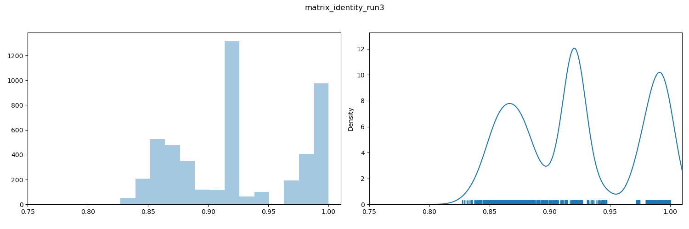
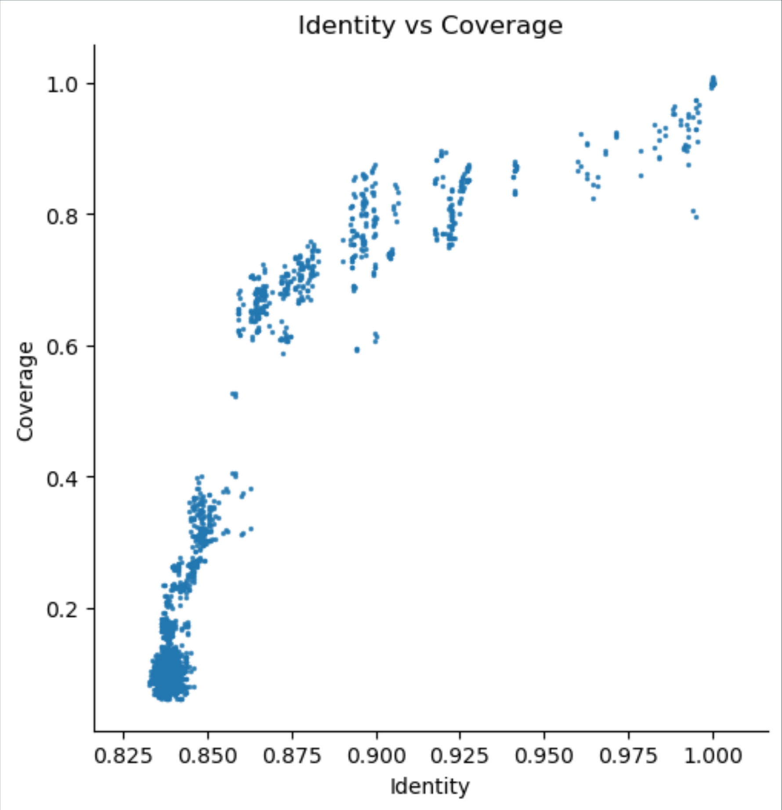

=================================
Interpreting the Graphical Output
=================================
..
    Graphical output is obtained by executing the ``pyani plot`` subcommand, specifying the output directory and run ID. Optionally, output file formats and the graphics drawing method can be specified.

    .. code-block:: bash

    pyani plot --formats png,pdf --method seaborn C_blochmannia_ANIm 1

    Supported output methods are:

    - ``seaborn``
    - ``mpl`` (``matplotlib``)
    - ``plotly``

----------
The Output
----------

``pyani plot`` generates five heatmaps corresponding to the matrices that ``pyani report`` produces:

  - percentage identity across all aligned regions (*Average Nucleotide Identity*, ANI)
  - percentage coverage of each genome by aligned regions (*Coverage*, or *Aligned Fraction* (AF))
  - number of bases from each genome contributing to the aligned regions
  - number of "similarity errors" on each genome
  - a Hadamard matrix of percentage identity multiplied by percentage coverage for each comparison

For each heatmap, a pair of plots describing the distributions of values in the heatmap/matrix are also generated. These show a histogram (left) and a KDE with rugplot (right) of the values in the heatmap.

In addition, a scatterplot of ANI vs Coverage/AF for each pairwise comparison is produced.

--------
Heatmaps
--------

^^^^^^^^^^^^^^^^^^^^^^^
Percentage Identity/ANI
^^^^^^^^^^^^^^^^^^^^^^^

.. figure:: images/matrix_identity_1.png
    :alt: percentage identity matrix for *Candidatus Blochmannia* ANIm analysis

    Percentage identity matrix for *Candidatus Blochmannia* ANIm analysis

    Each cell represents a pairwise comparison between the named genomes on rows and columns, and the number in each cell is the pairwise identity *of all aligned regions*. The dendrograms are produced by single-linkage hierarchical clustering trees from the matrix of pairwise identity results. The default colour scheme colours cells with identity > 0.95 as red, and those with < 0.95 as blue. This division corresponds to a widely-used convention for bacterial species boundaries.

.. note::

    No single ANI threshold should be considered universally applicable to distinguish between species for all bacterial genomes.

We can often take the red blocks on the main diagonal of the heatmap to indicate groups of genomes that are coherent with each other and exclude all other genomes in the analysis, which is one of the criteria we would use to delineate a biological species or other taxon. As a rule of thumb, red squares on the main diagonal are a good approximation to species.

Taking the 95% threshold between red and blue cells to be equivalent to a species boundary, an interpretation of this figure would be that:

* the two genomes BPEN and 640 could be classified as the same species
* the remaining four genomes each represent a distinct species

In particular, we can see that the off-diagonal identity values are all around 85%, consistent with the limit of detection for homologous nucleotide regions.

.. note::

    ANI reports the average percentage identity for the *aligned regions* only. If the total aligned proportion of either genome is not large, then ANI is not a reliable measure of overall genome similarity, and interpretation of percentage identity thresholds as species boundaries becomes less reliable. Percentage identity should always be considered in conjunction with coverage/aligned fraction.

^^^^^^^^^^^^^^^^^^^^^^^^^
Coverage/Aligned Fraction
^^^^^^^^^^^^^^^^^^^^^^^^^

.. figure:: images/matrix_coverage_1.png
    :alt: percentage coverage matrix for *Candidatus Blochmannia* ANIm analysis

    Percentage coverage matrix for *Candidatus Blochmannia* ANIm analysis

    Each cell represents a pairwise comparison between the named genomes on rows and columns, and the number in each cell is the pairwise coverage of each genome by aligned regions in the comparison. The dendrograms are generated by single-linkage hierarchical clustering from the matrix of pairwise coverage results. The default colour scheme colours cells with identity > 0.50 as red, and those with < 0.50 as blue. This division corresponds to a strict majority of each genome in the comparison being alignable (a plausible *ad hoc* minimum requirement for two sequences being considered "the same thing").

.. note::

    There is no widely-accepted convention for interpreting coverage/aligned fraction in its own right. Coverage should always be considered in conjunction with percentage identity and other measures.

The default graphical representation of coverage/AF distinguishes between alignments that cover more than 50% of the query genome (red) from those that cover less than 50% (blue). This is an *ad hoc* boundary with no particular biological meaning, but which does have a useful property that guides interpretation of the output.

If two genomes A and B align over less than 50% of genome A, then it is possible that the *majority* of genome A aligns to a different genome than genome B, with which genome B shares no homology. For instance, if the alignment of A and B has 30% coverage of genome A, it is possible that 70% of genome A is identical to another genome - C - which shares no sequence at all with genome B. In this case, it is perhaps not reasonable to assert that genomes A and B "are the same thing" or, in technical terms, *belong to the same taxon*.

However, if two genomes A and B align over more than 50% of their genomes - a majority of each genome - it is possibly reasonable to assert that the two genomes are, in some way, "the same thing" (and possibly correspond to the same taxon).

.. note::

    The 50% coverage threshold can be considered as a line of "caution." Where coverage is less than 50%, there is the possibility that the two genomes are not in the same taxon. However, this is not diagnostic.

Here, taking the 50% coverage threshold between red and blue cells to indicate an approximate boundary between genera, we would consider that BPEN and 640 are the same genus, but that each of the other genomes is representative of a distinct genus.

.. note::

    There is no agreed, universal coverage threshold corresponding to genus boundaries, so we should always consider the actual coverage/AF values

In this case, nearly all the off-diagonal values in the blue cells are below ≈5%. This indicates that the proportion of each genome in the off-diagonal alignments is very small, and we are safe to assert that these organisms come from different genera. The exception to this is the comparison between BVAF and floridianus: their coverage is higher, at ≈15%. This may indicate a common plasmid or mobile element, or it may indicate a more recent common ancestor than the other comparisons; they may or may not validly be in the same genus - we would need to investigate further to understand their relationship.

The BPEN/640 comparison is conclusive, however. Their coverage/AF is essentially 100%, so these are closely-related, highly sequence-homologous organisms.

------------------
Distribution Plots
------------------

    ANI value distribution plot

    In the distribution plots for each matrix, two figures are shown. On the left, a histogram of cell values is presented, representing binned values. On the right, a rug plot of individual matrix cell values and corresponding KDE plot (smoothed curve modelling the density as Gaussian distributions) is shown.

.. note::

    *Discontinuities* in the distribution of ANI values have been associated with taxonomically-useful boundaries, especially species boundaries (between 94-96% depending on lineage). It is common to see these as gaps in the rug plot.

By inspection, we can see a discontinuity (i.e. a gap) in the rug plot that spans 95%. This is consistent with many prior observations that species boundaries coincide with a 94-96% ANI threshold. This plot provides some support for the assertion that comparisons to the right of the gap (red in the heatmap) are within-species comparisons, and those to the left (blue in the heatmap) are between-species comparisons.

Other gaps/discontinuities are visible. The interpretations of these are highly context-dependent and it is not always clear whether they are taxonomically meaningful (e.g. subspecies or genus boundary), or reflect sampling biases. Further investigation and evidential support is necessary.

------------
Scatterplots
------------

    Scatterplot of coverage/aligned fraction vs ANI

    Plotting coverage/aligned fraction (y-axis) against ANI (x-axis) can be informative. Here, as is often the case for larger comparisons, there is a clear piecewise linear appearance to the plot. There is a relatively shallow gradient for high (>50%) coverage comparisons, and a steep gradient for low (<50%) coverage comparisons. There is a discontinuity on the coverage axis between ≈40% and 60% coverage, corresponding to a shift between the two piecewise linear regimes. This is often interpretable as a genus boundary, but requires further evidence and support to be certain.

Comparisons with high ANI but relatively low coverage for the dataset in question (these appear *below* the main population) may suggest the presence of a significant proportion of mobile elements in the sequenced genome.

Often a vertical banding can be seen, due to discontinuities in the distribution of ANI values. Here, the discontinuity at around 95% ANI is consistent with a division between within-species (right of the gap) and between-species (left of the gap) comparisons. Vertical bands to the left of the 95% line may indicate comparisons between particular pairs of species that are more or less recently diverged, but likely fall within the same genus.

The bulk of comparisons at the lower left of the plot likely indicate comparisons between relatively unrelated genomes, possibly from different genera.

--------------
Plot Asymmetry
--------------

.. note::

    Each ANI method in `pyani` calculates results by a different method. The difference between methods is usually that alternative third-party alignment tools are used. However, there may also be differences between the ways those alignment outputs are used. Please see the relevant documentation for details of each method.

**Average nucleotide identity** is a measure of similarity between two genomes. Depending on the ANI method used, this may be symmetrical: comparing genome A to genome B is the same as comparing genome B to genome A; or asymmetrical: the result of comparing genome A with genome B can be different from comparing genome B with genome A.

Asymmetry can arise as a consequence of the way the sequence alignment algorithm used for calculating genome alignments works. For instance, the initial seed alignment for a pair of genomes may be very similar, but not identical, and this difference may propagate through an extension step into differences in the final alignment. Alternatively, an aspect of the ANI algorithm may introduce asymmetry. For instance, the genome fragmentation step in ANIb may break each participating genome in different ways.

`pyani` provides both symmetrical and asymmetrical ANI methods:

  - ANIm — asymmetrical
  - FastANI — asymmetrical (only available in version 0.3.0-alpha)
  - ANIb — asymmetrical
  - ANIblastall — asymmetrical
  - TETRA — symmetrical (though please note that this is not strictly an ANI method)

**Alignment coverage** is the proportion of the query genome that aligns against the reference genome. This can be asymmetrical even when the alignment itself is symmetrical, as the genomes participating in a pairwise alignment may have differing amounts of genomic sequence that do not contribute to the alignment. In general, comparing genome A to genome B will give different coverage values for A and B.

    - in ANIm this is ``alignment_length / genome_length`` (asymmetrical)
    - in fastANI this is ``matched_fragments / all_fragments`` (asymmetrical)
    - in ANIb this is ``alignment_length / query_genome_length`` (asymmetrical)
    - in ANIblastall this is ``alignment_length / query_genome_length`` (asymmetrical)

**Alignment length** is the count of bases contributed by each genome to the pairwise alignment between those genomes.

  - in ANIm this is calculated as ``reference_positions_in_alignment + insertions - deletions``
  - in fastANI this is ``matched_fragments * fragment_length``
  - in ANIb this is ``alignment_length - gaps``
  - in ANIblastall this is ``alignment_length - gaps``

The **similarity errors** graph shows a measure of the number of bases/positions that do not match exactly.

  - in ANIm this is ``non-identities + insertions + deletions``
  - in fastANI this is ``all_fragments - matched_fragents``
  - in ANIb this is ``gaps + mismatches``
  - in ANIblastall this is ``gaps + mismatches``

The **Hadamard** ouptut is the elementwise product (identity x coverage), as described at `Hadamard product`_ of identity and coverage. It's meant to provide a measure that allows you to interpret identity and coverage simultaneously.

  - this is always ``ANI * coverage``, but as the plot is not symmetric, coverage may differ for query and reference genomes

``pyani plot`` also outputs a scatterplot of **Average nucleotide identity** versus **Alignment coverage** (calculated as described above).

.. _Hadamard product: https://en.wikipedia.org/wiki/Hadamard_product_(matrices)
