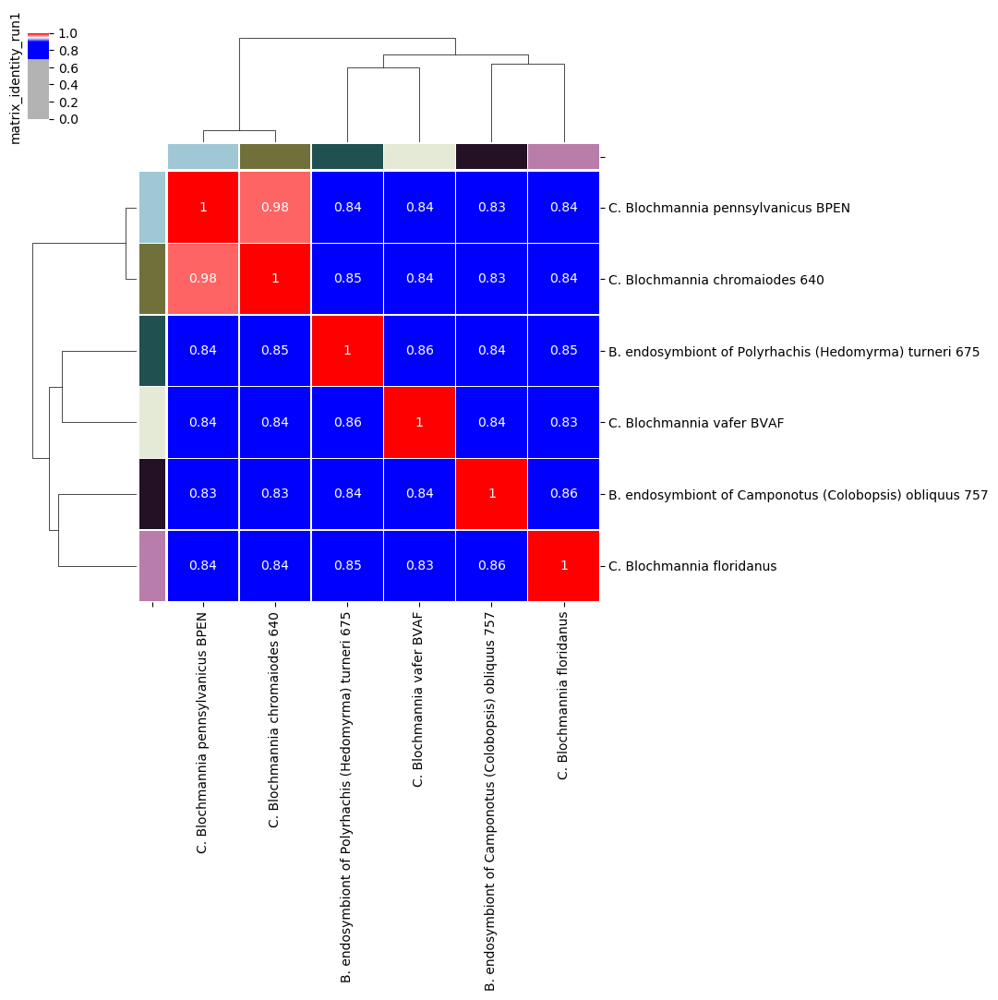
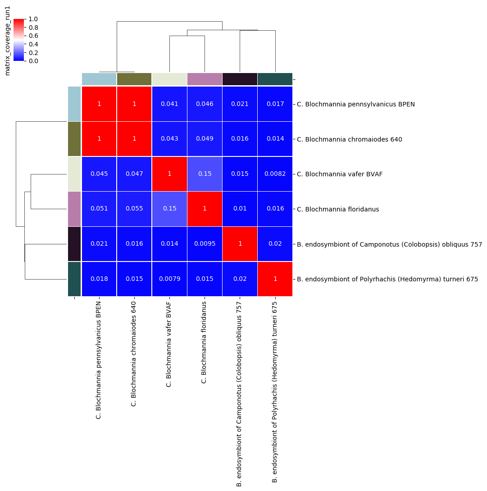

.. _pyani-quickstart:

================
QuickStart Guide
================

------------
Installation
------------

To use ``pyani`` you will need to install it on a local machine (your laptop, desktop, server or cluster). Installation is easiest using one of the two more popular Python package managers:

^^^^^^^^^^^^
1. ``conda``
^^^^^^^^^^^^

``pyani`` is available through the ``bioconda`` channel of `Anaconda`_:

.. code-block:: bash

    conda install -c bioconda pyani

^^^^^^^^^^^
2. ``PyPI``
^^^^^^^^^^^

``pyani`` is available *via* the `PyPI`_ package manager for Python:

.. code-block:: bash

    pip install pyani

.. TIP::
    ``pyani`` can also be installed directly from source, or run as a ``Docker`` image. More detailed, and alternative, installation instructions can be found on the :ref:`pyani-installation` page.

---------------------
``pyani`` Walkthrough
---------------------

The general procedure for any ``pyani`` analysis is:

1. Collect genomes for analysis
2. Create a database to hold genome data and analysis results
3. Perform ANI/TETRA/etc. analysis
4. Report and visualise analysis results
5. Generate species hypotheses (classify the input genomes) using the analysis results

To see options available for the ``pyani`` program, use the ``-h``
(help) option:

.. code-block:: bash

    pyani -h

An example ANIm (ANI with ``MUMmer``) analysis using ``pyani`` is provided as a walkthrough below. The sequence of commands used is:

.. code-block:: bash

    pyani download --email my.email@my.domain -t 203804 C_blochmannia
    pyani createdb
    pyani anim C_blochmannia C_blochmannia_ANIm \
        --name "C. blochmannia run 1" \
        --labels C_blochmannia/labels.txt --classes C_blochmannia/classes.txt
    pyani report --runs C_blochmannia_ANIm/ --formats html,excel,stdout
    pyani report --run_results 1 --formats html,excel,stdout C_blochmannia_ANIm/
    pyani report --run_matrices 1 --formats html,excel,stdout C_blochmannia_ANIm/
    pyani plot --formats png,pdf --method seaborn C_blochmannia_ANIm 1

.. TIP::
    If you have the ``pyani`` source code, you can run the walkthrough commands by executing ``make walkthrough`` at the command-line, in the repository root. You can clean up the walkthrough output with ``make clean_walkthrough``.

^^^^^^^^^^^^^^^^^^
1. Collect genomes
^^^^^^^^^^^^^^^^^^

It is possible to use genomes you have already placed into a local directory with `pyani`, but for this walkthrough a new set of genomes will be obtained from `GenBank`_, using the ``pyani download`` command.

.. TIP::
    To read more about using local files, please see the :ref:`pyani-indexing` documentation. To read more about downloading genomes from NCBI, please see the :ref:`pyani-download` documentation.

.. ATTENTION::
    To use their online resources programmatically, NCBI require that you provide your email address for contact purposes if jobs go wrong, and for their own usage statistics. This should be specified with the ``--email <EMAIL ADDRESS>`` argument of ``pyani download``.

Using the ``pyani download`` subcommand, we download all available genomes for *Candidatus Blochmannia* from NCBI. The taxon ID for this grouping is ``203804``, so that ID is passed as the ``-t`` argument. The final (compulsory) argument is a path to the directory into which the genome data will be downloaded.

.. code-block:: bash

    pyani download --email my.email@my.domain -t 203804 C_blochmannia

This creates a new directory (``C_blochmannia``) with the following contents:

.. code-block:: bash

    $ tree C_blochmannia
    C_blochmannia
    ├── GCF_000011745.1_ASM1174v1_genomic.fna
    ├── GCF_000011745.1_ASM1174v1_genomic.fna.gz
    ├── GCF_000011745.1_ASM1174v1_genomic.md5
    [...]
    ├── GCF_000973545.1_ASM97354v1_hashes.txt
    ├── classes.txt
    └── labels.txt

Each downloaded genome is represented by four files: the genome sequence (FASTA: ``*.fna``, compressed: ``*.fna.gz``), an NCBI hashes file (``*_hashes.txt``) and an MD5 hash of the genome sequence file (``*.md5``).

Two additional files are created, summarising all genomes in the subdirectory:

- ``classes.txt``: defines a *class* to which each input genome belongs. This is used for determining membership of groups and annotating graphical output.
- ``labels.txt``: provides text which will be used to label each input genome in the graphical output from ``pyani``

^^^^^^^^^^^^^^^^^^
2. Create database
^^^^^^^^^^^^^^^^^^

``pyani`` uses a local `SQLite3`_ database to store genome data and analysis results. Existing databases can be re-used. For this walkthrough we create a new, empty database by executing the command:

.. code-block:: bash

    pyani createdb

.. TIP::
    This creates the new database in a default location (``.pyani/pyanidb``), but the name and location of this database can be controlled with the ``pyani createdb`` command (see the :ref:`pyani-createdb` documentation), and a particular database can be specified in each of the subsequent commands.

^^^^^^^^^^^^^^^^^^^^^^^^
3. Conduct ANIm analysis
^^^^^^^^^^^^^^^^^^^^^^^^

We run ANIm on the downloaded genomes by specifying first the directory containing the genome data (here, ``C_blochmannia``) then the path to a directory which will contain the analysis results (``C_blochmannia_ANIm`` for this walkthrough).

We also provide a name for the analysis (``--name``, for later human-readable reference), with optional files defining labels for each genome to be used when plotting output (``--labels``) and a set of classes to which each genome belongs (``--classes``) for downstream analysis:

.. code-block:: bash

    pyani anim C_blochmannia C_blochmannia_ANIm \
        --name "C. blochmannia run 1" \
        --labels C_blochmannia/labels.txt --classes C_blochmannia/classes.txt

This command runs ANIm analysis on the genomes in the specified ``C_blochmannia`` directory. As we did not specifiy a database, the analysis results will be stored in the default database we created earlier (``.pyani/pyanidb``), where they will be identified by the name ``C. blochmannia run 1``. The comparison result files will be written to the ``C_blochmannia_ANIm`` directory.

^^^^^^^^^^^^^^^^^^^^^^^^^^^^^^^^^^^^^^^^^^
4. Reporting Analyses and Analysis Results
^^^^^^^^^^^^^^^^^^^^^^^^^^^^^^^^^^^^^^^^^^

We can list all the runs contained in the (default) database by using the command:

.. code-block:: bash

    pyani report --runs C_blochmannia_ANIm/ --formats html,excel,stdout

This will report the relevant information to new files in the ``C_blochmannia_ANIm`` directory.

.. code-block:: bash

    $ tree -L 1 C_blochmannia_ANIm/
    C_blochmannia_ANIm/
    ├── nucmer_output
    ├── runs.html
    ├── runs.tab
    └── runs.xlsx

.. TIP::
    By default the ``pyani report`` command will create a tab-separated text file with the ``.tab`` suffix, but by using the ``--formats`` option, we have also created an HTML file, and an Excel file with the same data. The ``stdout`` option also prints the output table to the terminal window.

By inspecting the ``runs.tab`` file (or any of the other ``runs.*`` files) we see that our walkthrough analysis has run ID ``1``. So we can use this ID to get tables of specific information for that run, such as:

**the genomes that were analysed in the run**

.. code-block:: bash

    pyani report --runs_genomes --formats html,excel,stdout C_blochmannia_ANIm/

**the complete set of pairwise comparison results** (listed by comparison)

.. code-block:: bash

    pyani report --run_results 1 --formats html,excel,stdout C_blochmannia_ANIm/

**comparison results as matrices** (percentage identity and coverage, number of aligned bases and "similarity errors", and a Hadamard matrix of identity multiplied by coverage).

.. code-block:: bash

    pyani report --run_matrices 1 --formats html,excel,stdout C_blochmannia_ANIm/

.. ATTENTION::
    The ``--run_results`` and ``--run_matrices`` options take a single run ID or a comma-separated list of IDs (such as ``1,3,4,5,9``) as an argument, and will produce output for each specified run ID.

Graphical output is obtained by executing the ``pyani plot`` subcommand and specifying the output directory and run ID.

.. code-block:: bash

    pyani plot --formats png,pdf --method seaborn C_blochmannia_ANIm 1

Supported output methods are:

- ``seaborn``
- ``mpl`` (``matplotlib``)
- ``plotly``

and each generates five plots corresponding to the matrices that ``pyani report`` produces:

- percentage identity of aligned regions
- percentage coverage of each genome by aligned regions
- number of aligned bases on each genome
- number of "similarity errors" on each genome
- a Hadamard matrix of percentage identity multiplied by percentage coverage for each comparison

    Percentage identity matrix for *Candidatus Blochmannia* ANIm analysis

    Each cell represents a pairwise comparison between the named genomes on rows and columns, and the number in the cell is the pairwise identity *of aligned regions*. The dendrograms are single-linkage clustering trees generated from the matrix of pairwise identity results. The default colour scheme colours cells with identity > 0.95 as red, and those with < 0.95 as blue. This division corresponds to a widely-used convention for bacterial species boundaries.

    Percentage coverage matrix for *Candidatus Blochmannia* ANIm analysis

    Each cell represents a pairwise comparison between the named genomes on rows and columns, and the number in the cell is pairwise coverage of each genome by aligned regions in the comparison. The dendrograms are single-linkage clustering trees generated from the matrix of pairwise coverage results. The default colour scheme colours cells with identity > 0.50 as red, and those with < 0.50 as blue. This division corresponds to a strict majority of each genome in the comparison being alignable (a plausible minimum requirement for two sequences being considered "the same thing").

Several graphics output formats are available, including ``.png``, ``.pdf`` and ``.svg``.

.. _Anaconda: https://www.anaconda.com/what-is-anaconda/
.. _GenBank: https://www.ncbi.nlm.nih.gov/nuccore
.. _NCBI Taxonomy database: https://www.ncbi.nlm.nih.gov/taxonomy
.. _PyPI: https://pypi.python.org/pypi
.. _SQLite3: https://www.sqlite.org/index.html
