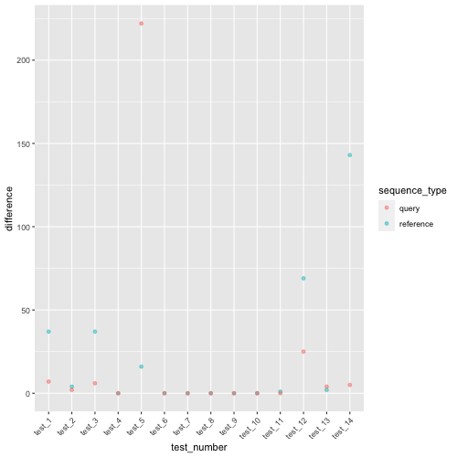

# Walkthrough LP's `mummer_alignedbases.md`

## Overview
LP kindly looked at the source code of `dnadiff` with the attempt to understand how it calculates the value of AlignedBases. In this document, I will follow the 'mummer_alignedbases.md' to verify my understanding of the process. To achieve this, I will use the same example as presented in 'mummer_alignedbases.md'...

```bash
% dnadiff AF_bug_v2/MGV-GENOME-0357962.fna AF_bug_v2/MGV-GENOME-0358017.fna
% head -n 14 out.report
/Users/lpritc/Development/pyani/issue_340/donovan_test/AF_bug_v2/MGV-GENOME-0357962.fna /Users/lpritc/Development/pyani/issue_340/donovan_test/AF_bug_v2/MGV-GENOME-0358017.fna
NUCMER

                               [REF]                [QRY]
[Sequences]
TotalSeqs                          1                    1
AlignedSeqs               1(100.00%)           1(100.00%)
UnalignedSeqs               0(0.00%)             0(0.00%)

[Bases]
TotalBases                     87285                87353
AlignedBases          87285(100.00%)       87353(100.00%)
UnalignedBases              0(0.00%)             0(0.00%)
```

Here, we aim to replicate the number of algned bases for refernce (87,285) and  query (87,353). 


## Step 1
For AlignedBases to be caluclated, the sequences (genomes) need to be first aligned. `dnadiff` uses other programs like `nucmer` and `delta-filter` to do this. (`pyANI` calls the same programs.) 

After these programs are run, dandiff provides us with two delta files:
- `.1delta` - 1-to-1 alignments
- `.mdelta` - many-to-many aligments

__NOTE__: `dnadiff` calls other programs like `SHOW_SNPS` and `SHOW_DIFF`, but as these are not relevant for the replication of `AlignedBases` value, I will skip these for now. 


## Step 2
Now that the alignments are generated, we can process them to calculate the following relevant values:

- `rnSeqs`: number of sequences in the genome
- `rnBases`: number of bases in the genome
- `rnABases`: number of aligned bases in the genome; the `AlignedBases` value, which is the focus of our analysis

So far, we know that `dnadiff` opens and uses `.mcoords` files. According to `dnadiff` documentation, `.mcoords` provides us with `M-to-M coordinates from show-coords -THrcl .mdelta`. From this, we understand that `.mcoords` is derived from the `.mdelta` file. Therefore, for the time being, we can assume that both of these files contain the same information, and there should be no difference in using either of them in terms of future outputs and result replication.

Here is the `.mdelta` file provided by `dnadiff` for our example analysis:


```bash
/Users/lpritc/Development/pyani/issue_340/donovan_test/AF_bug_v2/MGV-GENOME-0357962.fna /Users/lpritc/Development/pyani/issue_340/donovan_test/AF_bug_v2/MGV-GENOME-0358017.fna
NUCMER
>MGV_MGV-GENOME-0357962 MGV_MGV-GENOME-0358017 87285 87353
1 24024 63330 87353 5 5 0
0
23884 24176 1 293 0 0 0
0
24107 87285 176 63368 51 51 0
-121
-1
-1
-1
-1
-1
-1
-1
-1
-1
-1
-1
-10416
-1
0
```

As per the [documentaion](https://github.com/mummer4/mummer/blob/master/docs/nucmer.README), this provides us with a lot of useful information. 

- The header line indicates the input files (reference then query)
```bash
/Users/lpritc/Development/pyani/issue_340/donovan_test/AF_bug_v2/MGV-GENOME-0357962.fna /Users/lpritc/Development/pyani/issue_340/donovan_test/AF_bug_v2/MGV-GENOME-0358017.fna
```

- The next line indicates program used (eg. `NUCMER` or `PROMER`)

```bash
NUCMER
```
- The aligned regions between the two sequences are idenicated by the header (`>`). Here, the two aligned sequences are separted by a space (refernce then query) followed by lengths of those sequences in the same order.

```bash
>MGV_MGV-GENOME-0357962 MGV_MGV-GENOME-0358017 87285 87353
```

- The next line gives us more information about the aligned sequences in the following order:

    - \<start position of the alignment in reference\> 
    - \<end position of the alignment in the reference\>
    - \<start position of the aligment in the query\>
    - \<end position of the aligment in the query>
    - \<non-identies + indels error\>
    - \<similarity error\>
    - \<stop codons\>

```bash
1 24024 63330 87353 5 5 0
```

Aligned regions end with `O`, and from our `.mdelta` file we can see that there are 3 regions, of which the last one conatins additional infomration. This information refers to the indels in the alignment:
- positive number = insertion in the refrence
- negative number = delation (gaps) in the refernce

```bash
24107 87285 176 63368 51 51 0
-121
-1
-1
-1
-1
-1
-1
-1
-1
-1
-1
-1
-10416
-1
0
```
This can be interpreted as in the third alignment, which runs from 24,107 to 87,285 in reference, and from 176 to 63,368 in the query, there is a deleation of 12 bases in the refernce which starts at the position 121 and ends at 132. There us a futher deleation of two bases at 10,416 and 10,417. 


Knowing the structure of the `mdelta` file, we can attempt to calculate the total lengths of the alignments using `Python`. Here, as indicated in `out.report` by `dnadiff`, the total length of the alignments for the reference is 87,496, and for the query, it is 87,510.


```bash
M-to-M                             3                    3
TotalLength                    87496                87510
AvgLength                   29165.33             29170.00
AvgIdentity                    99.94                99.94
```

I written a code which replicates these values when parisng the `.mdelta` file. 

```Python
def parse_delta(infname):
    """Parse delta files.

    :param infname: Path to delta file
    """

    TotalLength_ref, TotalLength_qry, current_ref, current_qry =0, 0, None, None

    for line in [_.strip().split() for _ in infname.open("r").readlines()]:
            if line[0].startswith(">"):
                current_ref = line[0].strip('>')
                current_qry = line[1]
            if len(line) == 7:
                TotalLength_ref += abs(int(line[1])-int(line[0]))+1
                TotalLength_qry += abs(int(line[3])-int(line[2]))+1

```

In this code, I have defined a function that will parse the delta file in the following steps:

1. Assigns initial values of 0 to the lengths of reference alignments (`TotalLength_ref`) and query alignments (`TotalLength_ref`) and sets the initial sequence IDs of the reference (current_ref) and query (current_qry) to `None`.

```Python
TotalLength_ref, TotalLength_qry, current_ref, current_qry =0, 0, None, None
```
2. It reads the `.delta` file and checks if each line starts with `>`. This is done to retrieve the sequence IDs for the aligned reference (`current_ref`) and query (`current_qry`) sequences.

```Python
    for line in [_.strip().split() for _ in infname.open("r").readlines()]:
            if line[0].startswith(">"):
                current_ref = line[0].strip('>')
                current_qry = line[1]
```
3. The script then checks for lines containing 7 items. This step is crucial for identifying lines that provide more specific information about the alignments, such as the start and end positions of the alignment in the reference or query. Subsequently, the script uses this information to calculate the lengths of the aligned regions (end position - start position + 1) for both the reference and query. Finally, it increments `TotalLength_ref` and `TotalLength_qry` by the corresponding alignment lengths

```Python
            if len(line) == 7:
                TotalLength_ref += int(line[1])-int(line[0])+1
                TotalLength_qry += int(line[3])-int(line[2])+1
```

Running this code on our examplar data returns that the total number of aligned bases in the reference is 87,496 and in qry 87,510, which corresponds to the values of `TotalLength` on the `out.report` for `M-to-M` alignments. For example...


```bash
M-to-M                             3                    3
TotalLength                    87496                87510
AvgLength                   29165.33             29170.00
AvgIdentity                    99.94                99.94
```


## Issue 1
The `TotalLength` values returned by `dnadiff` and our in-house script are indicating that the total number of aligned bases in both (reference and query) are longer than either genome. We are already aware that there are overlapping regions causing this issue. LP represented the issue as follows (for more information, refer to `mummer_alignedbases.md`)
```text
1 ============ 24024
     23884 ============== 24176
                 24107 =========== 87285
```

We have attempted to solve this issue in `Python` by again using the `.mdelta` file as an input.

```Python
def parse_delta(infname):
    """Parse delta files.

    :param infname: Path to delta file
    """

    TotalLength_ref, TotalLength_qry, current_ref, current_qry =0, 0, None, None

    regions_ref = defaultdict(list) #Hold a dictionary for refence regions
    regions_qry = defaultdict(list) #Hold a dictionary for query regions

    for line in [_.strip().split() for _ in infname.open("r").readlines()]:

            if line[0] == "NUCMER":  # Skip headers
                    continue
            if line[0].startswith(">"):
                current_ref = line[0].strip('>')
                current_qry = line[1]
            if len(line) == 7:
                TotalLength_ref += abs(int(line[1])-int(line[0]))+1
                TotalLength_qry += abs(int(line[3])-int(line[2]))+1

                regions_ref[current_ref].append(tuple(sorted(list([int(line[0]), int(line[1])]))))
                regions_qry[current_qry].append(tuple(sorted(list([int(line[2]), int(line[3])]))))

```

Here, we reuse our previous code, in which we replicated the `TotalLength` from `dnadiff`, and tweak it by adding the following:

- Declare two empty defaultdicts: one for the reference (`regions_ref`) and one for the query (`regions_qry`).


```Python
    regions_ref = defaultdict(list) #Hold a dictionary for refence regions
    regions_qry = defaultdict(list) #Hold a dictionary for query region
```   

- In this code, we once again focus on lines containing 7 items, which provide specific information about the alignments such as the start and end positions of the alignment in the reference or query. This information is utilized and appended to the dictionaries in the following format:

```Python 
'sequnece_ID' : [(alignment_1_start_position, alignment_1_end_position)]

```

- This is done with the follwoing lines 
```Python
            if len(line) == 7:
                regions_ref[current_ref].append(tuple(sorted(list([int(line[0]), int(line[1])])))) #aligned regions reference
                regions_qry[current_qry].append(tuple(sorted(list([int(line[2]), int(line[3])])))) #aligned regions qry
```


This dictionary provides us with information about regions of each sequence in the used genomes that are aligned.

In the next section of code, we attempt to calculate/replicate the `AlignedBases`. We first set the initial value of the aligned bases (here, for the reference sequence; `ref_total_aligned_size`) as 0. Then, we loop through each item in the dictionary and merge the overlapping regions with `intervaltree`. Once the overlaps are merged, we calculate the size of the aligned region (\<end of the aligned region\> - \<start of the aligned region\> + 1), and increment the `ref_total_aligned_size` (for reference) by this number.

```PYTHON
    #Getting aligned based for reference sequence
    ref_total_aligned_size = 0
    for key in regions_ref:
        ref_tree = intervaltree.IntervalTree.from_tuples(regions_ref[key])
        ref_tree.merge_overlaps()
        ref_aligned_size = 0
        for interval in ref_tree:
            ref_aligned_size += interval.end - interval.begin + 1
        ref_total_aligned_size += ref_aligned_size
```

Running this code on our examplar dataset, we obtained a value of 87,285 for reference and 87,353 for query. This matches the `AlignedBases` value reported by `dnadiff`. 


```bash
% dnadiff AF_bug_v2/MGV-GENOME-0357962.fna AF_bug_v2/MGV-GENOME-0358017.fna
% head -n 14 out.report
/Users/lpritc/Development/pyani/issue_340/donovan_test/AF_bug_v2/MGV-GENOME-0357962.fna /Users/lpritc/Development/pyani/issue_340/donovan_test/AF_bug_v2/MGV-GENOME-0358017.fna
NUCMER

                               [REF]                [QRY]
[Sequences]
TotalSeqs                          1                    1
AlignedSeqs               1(100.00%)           1(100.00%)
UnalignedSeqs               0(0.00%)             0(0.00%)

[Bases]
TotalBases                     87285                87353
AlignedBases          87285(100.00%)       87353(100.00%)
UnalignedBases              0(0.00%)             0(0.00%)
```

However, to make sure that the code written does what we think it's supposed to be doing, and these values are not matching just by chance, here we test it on more data. Here, we:
- Generated a few more test sets
- Ran `dnadiff` on them to get the value of `AlignedBases`
- Checked if we can replicate the value for `AlignedBases` and `TotalLength` with our code
- Compared the values with `pytest` in Python

As we wish for `pyANI` to work on both bacterial and viral genomes, the following tests will include a mixture of bacterial and viral genomes:
- Test 1: Streptomyces genomes (2 complete genomes)
- Test 2: Streptomyces genomes (2 draft genomes)
- Test 3: Dickeya aquatica (see Leighton's test 2)
- Test 4: Leighton's small test
- Test 5: Pactobacterium atrosepticum (SCRI1043 and JG10-08) from NCBI. We could not get the supplementary info from Leighton's paper promoting pyANI. 
- Test 6: Donovan's viral genomes (for more information, visit [here](https://github.com/widdowquinn/pyani/issues/340))
- Test 7: Feline Coronavirus (complete genomes)
- Test 8: Influenza A (complete genomes)
- Test 9: Equine parapoxvirus
- Test 10: Ebola
- Test 11: Streptomyces genomes (2 complete)
- Test 12: Streptomyces genomes (2 chromosomal)
- Test 13: Streptomyces (2 contig level)
- Test 14: Streptomyces (2 scaffold)

### pytest to compare TotalLength values

We compared the `TotalLength` values for all test sets for both reference and query with the values we get from our script provided in `scripts/parsing_delta.py`. The test can be viewed in `TotalLength_pytest.py`. 

The below pytests - comparing all `TotalLengths` provided by `dnadiff` (for both reference and query) and our values that we tried to replicate with our code, show that our code works as we think it does, as all tests pass. 

Here, we also included additional tests that failed when we wanted them to fail, e.g., by passing a path to the `.mdleta` file that does not exist, comparing values that are not the same, or comparing wrong types of objects (e.g., string to int).

The results of these pytests were as follows:"

These are minor adjustments for clarity, and your overall text is well-organized and informative.


```bash
(pyani_dev) angelikakiepas@Angelikas-MacBook-Pro issue_340 % pytest TotalLength_pytest.py
====================================================================================================================== short test summary info ======================================================================================================================
FAILED TotalLength_pytest.py::test_TotalLength_test_15 - FileNotFoundError: [Errno 2] No such file or directory: 'this_path_does_not_exists'
FAILED TotalLength_pytest.py::test_TotalLength_QRY_test_16 - AssertionError: assert 4509104 == '4509104'
FAILED TotalLength_pytest.py::test_TotalLength_QRY_test_17 - assert 4509104 == 5264616
=================================================================================================================== 3 failed, 28 passed in 2.61s ====================================================================================================================
```

__pytest to compare TotalLength  values__

We compared the `AlignedBases` values for all tests sets for both reference and query with the values we get from our script provided in `scripts/parsing_delta.py`. The test can be viewed in `AlinedBases_pytest.py`. And the results are as follow:


```bash
================================================================================================================== short test summary info ===================================================================================================================
FAILED AlignedBases_pytest.py::test_AlignedBases_REF_test_1 - assert 4480744 == 4480707
FAILED AlignedBases_pytest.py::test_AlignedBases_QRY_test_1 - assert 4483292 == 4483285
FAILED AlignedBases_pytest.py::test_AlignedBases_REF_test_2 - assert 5264562 == 5264558
FAILED AlignedBases_pytest.py::test_AlignedBases_QRY_test_2 - assert 5251797 == 5251795
FAILED AlignedBases_pytest.py::test_AlignedBases_REF_test_3 - assert 444134 == 444097
FAILED AlignedBases_pytest.py::test_AlignedBases_QRY_test_3 - assert 415673 == 415667
FAILED AlignedBases_pytest.py::test_AlignedBases_REF_test_5 - assert 4832975 == 4832959
FAILED AlignedBases_pytest.py::test_AlignedBases_QRY_test_5 - assert 4829568 == 4829346
FAILED AlignedBases_pytest.py::test_AlignedBases_REF_test_11 - assert 7844784 == 7844783
FAILED AlignedBases_pytest.py::test_AlignedBases_REF_test_12 - assert 1574238 == 1574169
FAILED AlignedBases_pytest.py::test_AlignedBases_QRY_test_12 - assert 1583295 == 1583270
FAILED AlignedBases_pytest.py::test_AlignedBases_REF_test_13 - assert 1811681 == 1811679
FAILED AlignedBases_pytest.py::test_AlignedBases_QRY_test_13 - assert 1811477 == 1811473
FAILED AlignedBases_pytest.py::test_AlignedBases_REF_test_14 - assert 5612422 == 5612279
FAILED AlignedBases_pytest.py::test_AlignedBases_QRY_test_14 - assert 5669108 == 5669103
=============================================================================================================== 15 failed, 13 passed in 2.12s ================================================================================================================
```
Key notes from this:
- We only replicated the `dnadiff AlignedBases` values for test sets 6 to 10, which are viral genomes. Although, this could be coincidence.
- Accounting for overlaps for bacterial genomes is not enough to replicate the `AlignedBases`.

Things that we might want to consider or rule out, regarding these results so far: 

1. **What is the difference between our value for aligned bases and the one provided by `dnadiff`?**

   

   The figure above shows the difference between our value for aligned bases and the one provided by `dnadiff`. The difference was calculated for all tests that we carried out (1-14) for both query and reference, and was calculated by subtracting the value of `AlignedBases` provided by `dnadiff` from our value obtained from our in-house script.

   In all cases where we did not achieve to replicate the `AlignedBases` value from `dnadiff`, we reported more bases than `dnadiff`. This could perhaps mean that there is an additional step done by `dnadiff` in how they reported the total number of aligned bases, or perhaps there is a bug in our or `dnadiff` code.

2. **Could this difference in reported values be due to the use of different files when processing the alignments (e.g., we used `.mdleta` where `dnadiff` used `mcoords`)?**

   To answer this question, it would be beneficial to replicate the values by trying to calculate the number of aligned bases by the use and parsing of `mcoords` files. This would allow us to determine whether `.mdelta` and `mcoords` provide the same information about the alignments, and to rule out that this might be the cause of different values being reported by `dnadiff` and our code.

   LP has already written a code that can parse the `mcoords` files, where he accounts for overlaps. The script is provided in `scripts/simple_parsing_LP.py`.

   Here, we compared the results of `parse_delta.py` and `simple_parsing.py` with `pytest`, which show that we do get congruent values for what we currently consider aligned bases from both `mdelta` and `mcoord` files.


```bash
(pyani_dev) angelikakiepas@Angelikas-MacBook-Pro issue_340 % pytest mdelta_vs_mcoords_pytest.py
==================================================================================================== test session starts =====================================================================================================
platform darwin -- Python 3.8.2, pytest-7.4.0, pluggy-1.0.0
rootdir: /Users/angelikakiepas/Desktop/pyani_repo/pyani
configfile: pytest.ini
collected 28 items                                                                                                                                                                                                           

mdelta_vs_mcoords_pytest.py ............................                                                                                                                                                               [100%]

===================================================================================================== 28 passed in 3.10s =====================================================================================================
```

3. Could it be that `dnadiff` take into account the failure to align bases due to indels? 

In progress...

