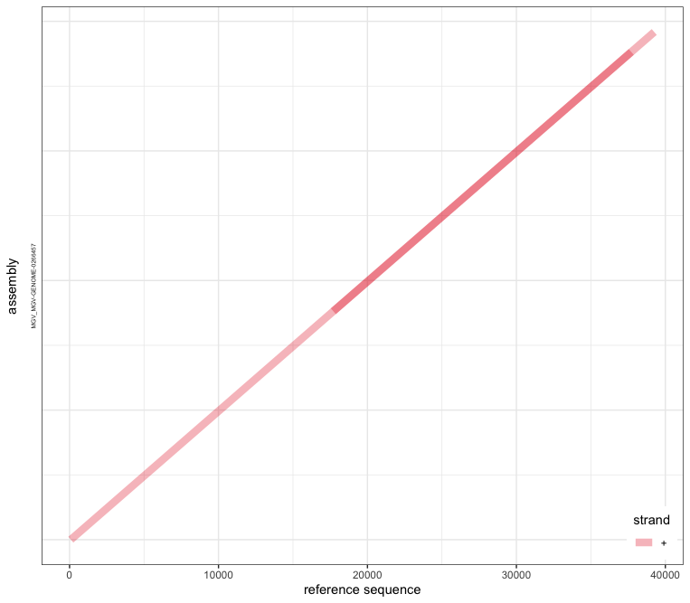
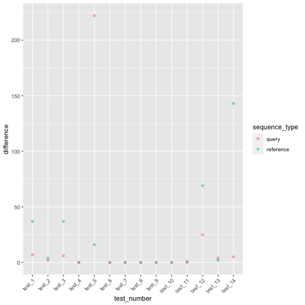
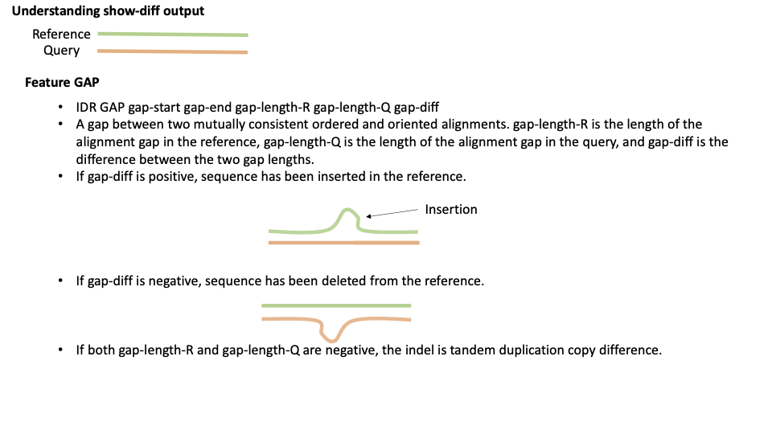
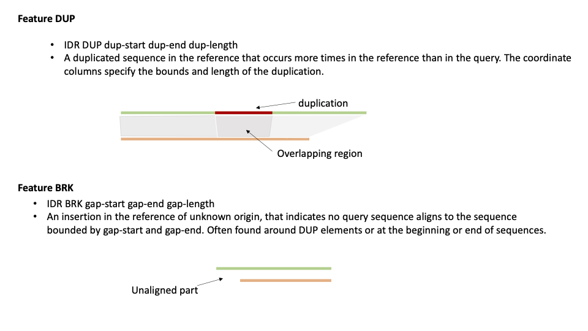
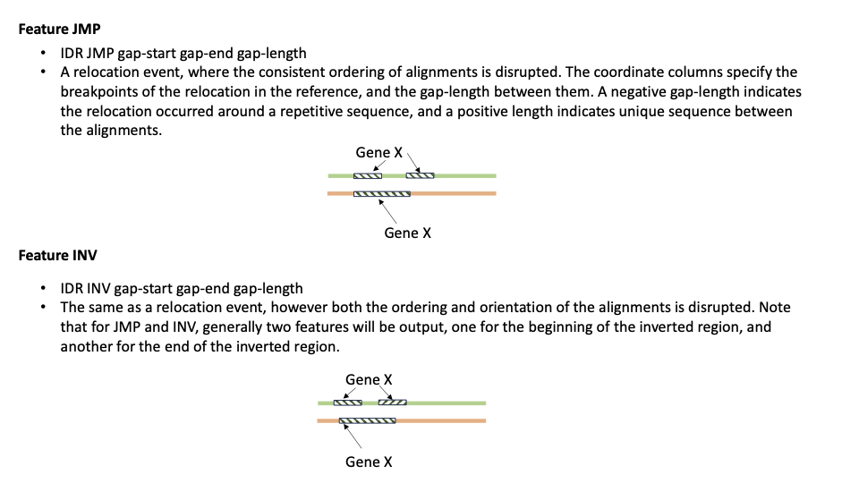
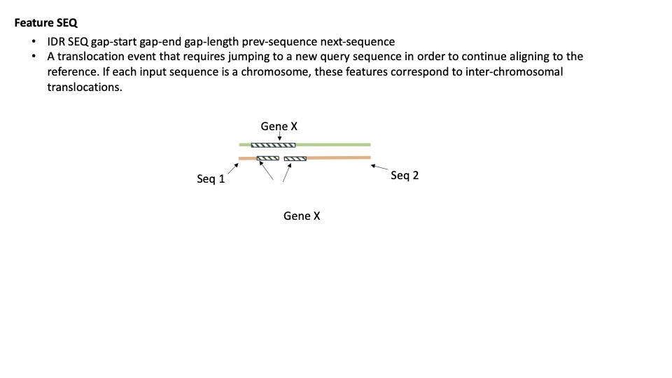

# Issue 340
This repository contains all code, supplementary information and test sets regrding pyani issue 340. 

# Overview
Ocassionally pyANI reports genome coverage value of more than 1.0, as reported by [Donovan H.Parks](https://github.com/donovan-h-parks). Previous conversations about the issue can be viewed [here](https://github.com/widdowquinn/pyani/issues/340) and [here](https://github.com/widdowquinn/pyani/issues/342).

# What we know so far about the issue
- Although it can affect both bacterial and viral comparions, it seems to be more of an issue for viral genome comparions. 
- After reproducing Donovan's issue, it was found that the likely cause of high genome coverage reported by pyANI comes from the parsing of the `nucmer` output files (`delta` and `filter`), where certain regions are overlapped and counted twice. 

The issue was reproduced, and here is the content of the `delta` file given by pyANI/nucmer. 

```bash
/Users/angelikakiepas/Desktop/pyani_issue_alignment_coverage/scripts/../input/MGV-GENOME-0264574.fna /Users/angelikakiepas/Desktop/pyani_issue_alignment_coverage/scripts/../input/MGV-GENOME-0266457.fna
NUCMER
>MGV_MGV-GENOME-0264574 MGV_MGV-GENOME-0266457 39253 39594
85 37713 1 37636 215 215 0
-3013
-24624
-1
-1
-1
-1
-1
0
17709 39253 17626 39176 7 7 0
-9994
-1
-1
-1
-1
-1
0

```
As spotted by Leighton, one alignment runs from position 85 to 37713 in the query, and other alignment runs from 17709 to 39253.  The alignment length output shows that the aligned sequence length is longer than either genome.


Here, is the visual representation of the problem:


- There was a suggestion to use the `--noextend` parameter for `MUMmer` to prevent it from reporting two overlapping alignments. However, this did not resolve the issue. To address the problem, we need to write a code that will appropriately parse the `MUMmer`/`nucmer` output files, excluding overlaps when calculating genome coverage.

- `dnadiff` can compare genomes, which returns value for aligned bases (`AlignedBases`), which can be interpreted as the genome coverage. 


```bash
$ mkdir -p dnadiff_default && dnadiff -p dnadiff_default/high_align_test high_align_cov/MGV-GENOME-0264574.fna high_align_cov/MGV-GENOME-0266457.fna
[...]
/Users/lpritc/Development/GitHub/pyani/issue_340/high_align_cov/MGV-GENOME-0264574.fna /Users/lpritc/Development/GitHub/pyani/issue_340/high_align_cov/MGV-GENOME-0266457.fna
NUCMER

                               [REF]                [QRY]
[Sequences]
TotalSeqs                          1                    1
AlignedSeqs               1(100.00%)           1(100.00%)
UnalignedSeqs               0(0.00%)             0(0.00%)

[Bases]
TotalBases                     39253                39594
AlignedBases           39169(99.79%)        39176(98.94%)
UnalignedBases             84(0.21%)           418(1.06%)

[Alignments]
1-to-1                             2                    2
TotalLength                    59174                59187
AvgLength                   29587.00             29593.50
AvgIdentity                    99.63                99.63
[...]

```
We can treat the `AlignedBases` value as a starting point for coverage. To see if we understand how these values were calculated, we will try to recalculate this value manlually.

We have the following infomration about the sequences:

    Genome 1 (REF): MGV_MGV-GENOME-0264574 
    Genome 2 (QRY): MGV_MGV-GENOME-0266457

    REF length: 39253
    QRY length: 39594

**Calculations for the reference**

    1st alignment start: 85
    1st alignment end: 37713
    Number of bases aligned in 1st alignment: 37713-85+1= 37629

    2nd alignment start: 17709
    2nd alignment end: 39253
    Number of bases aligned in 2nd alignment: 39253-17709+1=21545

    Number of bases that are overlapped: 37713-17709= 20005

By including the overlaps we will get the following results:

    Number of total aligned bases: 37629+21545 =59174
    Coverage with duplicate alignments: 59174/39253 = 1.5071

When excluding the overlaps we will get the following results:

    Number of total aligned bases: 37629+21545-20005 = 39169

    Now by exclusion of the duplicate alignments, we can get the following coverage: 39169/39253 = 0.9979

**Calculations for the query**

    1st alignment start: 1
    1st alignment end: 37636
    Number of bases aligned in 1st alignment: 37636-1+1= 37636

    2nd alignment start: 17626
    2nd alignment end: 39176
    Number of bases aligned in 2nd alignment: 39176-17626+1=21551

    Number of bases that are overlapped: 37636- 17626=20011

When excluding the overlaps we will get the following results:

    Number of total aligned bases: 37636+21551-20011 = 39176

    Now by exclusion of the duplicate alignments, we can get the following coverage: 39176/39594 = 0.9894

## Replication of AlignedBases with Python
The aim is to replicate the value of AlignedBases reported by `dnadiff`. LP kindly looked at the source code of dnadiff with the attempt to understand how it calculates the value of AlignedBases. Here, we attempt to replicate the code in `Python` using the same process as implemented in `dnadiff`. The code can be found in `scripts/mummer_alignedbases.py`. 

Let's talk about what the code is doing, by using the same example as used at the beginning of this document:

__Step Up: Loading all Python modules/packages needed to run the analysis.__

```python
from Bio import SeqIO
import pandas as pd
from pathlib import Path
```
__Step 1: Getting basic sequence information.__ 

_What does dnadiff do?_

Relevant variables in the script are (considering only the reference sequence data, at first):

- `rnSeqs`: number of sequences in the genome
- `rnBases`: number of bases in the genome
- `rnABases`: number of aligned bases in the genome; this is what gets reported as `AlignedBases` and is the focus of our analysis of the code.

_What can we do?_

We can create variables for `rnSeqs`, `rnBases` and`rnABases`, and set them to 0 for now. We will append all relevant information later.

```python 
rnSeqs = 0
rnBases = 0
rnABases = 0
```

_What does dnadiff do?_

The name of each sequence in the genome, and the corresponding length, is read into a hash table (l.252) analogous to a Python dictionary, keyed by sequence ID:

```perl
FastaSizes($OPT_RefFile, \%refs);
```

_What can we do?_

We can load and parse genome data using `SeqIO` module, and create a dictionary with sequence IDs as keys, and the length of each sequence as values. 

```python
records = list(SeqIO.parse("issue_340_tests_AK/inputs/test_6/MGV-GENOME-0264574.fna", "fasta"))
refs = {record.id:len(record.seq) for record in records}
```

_What does dnadiff do?_

The total number of bases in the genome is derived from this hash table:

```perl
foreach ( values(%refs) ) {
      $rnSeqs++;
      $rnBases += $_;
  }
```

which increments the count of sequences, as well as the sum of sequence lengths (total bases).


_What can we do?_

We can loop though the our `refs` dictionary, and append update the values of `rnSeqs` and `rnBases` accordingly. 

```python
for sequence_id, sequence_length in refs.items():
    rnSeqs += 1
    rnBases += sequence_length
```
__Step 2: Retriving information from M-to-M aligments. (`.mcoords`)__

_What does dnadiff do?_

The script opens the many-to-many coordinates file (`.mcoords`), which has the form:

```bash
/Users/angelikakiepas/Desktop/pyani_issue_340/scripts/../inputs/donovan_input/MGV-GENOME-0264574.fna /Users/angelikakiepas/Desktop/pyani_issue_340/scripts/../inputs/donovan_input/MGV-GENOME-0266457.fna
NUCMER
>MGV_MGV-GENOME-0264574 MGV_MGV-GENOME-0266457 39253 39594
85 37713 1 37636 215 215 0
-3013
-24624
-1
-1
-1
-1
-1
0
17709 39253 17626 39176 7 7 0
-9994
-1
-1
-1
-1
-1
0
```

This has 13 columns. Each line represents a single alignment. `dnadiff.pl` processes only some of these columns.

The number of alignments `rqnAlignsM++` is incremented with each line (total number of alignments, l.274). 
The sum of alignment region lengths is incremented with column 4 (`$rSumLenM += $A[4];`, l.275). 
The sums of match identities (`$rqSumIdyM += ($A[6] / 100.0) * ($A[4] + $A[5]);`) and match lengths (`$rqSumLenM += ($A[4] + $A[5]);`) are gathered.

_What can we do?_

This calulcations in `perl` can be easliy done in `Python`. We can use the `.mcoords` file, and try to reproduce these results. 

But first we need to create all relevant variables. 

```python
mcoords = pd.read_csv(Path("issue_340_tests_AK/outputs_dnadiff/test_6/donovan_dnadiff.mcoords"), sep='\t', names=[f"col_{_}" for _ in range(0,13)])

rqnAlignsM = 0
rSumLenM = 0
rqSumIdyM = 0
rqSumLenM = 0
rnASeqs = 0

for index, row in mcoords.iterrows():
    rqnAlignsM += 1
    rSumLenM += row['col_4']
    rqSumIdyM += (row['col_6']/100) * (row['col_4'] + row['col_5'])
    rqSumLenM += (row['col_4'] + row['col_5'])
```

_What does dnadiff do?_

Next, for this row/alignment in the `.mcoords` file, `dnadiff.pl` checks to see if this sequence from the genome has been seen before. If it has not, then it increments the number of aligned sequences `rnASeqs`, and updates the number of aligned bases `rnABases` (ll.280-285):

```perl
#-- If new ID, add to sequence and base count
if ( $refs{$A[11]} > 0 ) {
    $rnASeqs++;
    $rnABases += $refs{$A[11]};
    $refs{$A[11]} *= -1; # If ref has alignment, length will be -neg
}
```
_What can we do?_

Again, these calculations can be easliy done in Python. So here, we will:
- Create an empty list for `seen` sequences to which we can append things when needed. 
- We can inerate through each row in `.mcoords` file, and check if the sequence was seen.
    - If sequence was not seen before, we can update valuesfor `rnASeqs` and `rnABases` accoridngly. Once that is complete, we can append the sequence ro the list of seen sequences. 
    - If sequence was seen, we can move onto another row. 

```python
seen_ref_seq = []
for index, row in mcoords.iterrows():
    if row['col_11'] not in seen_ref_seq:
        rnASeqs += 1
        rnABases += refs[row['col_11']]
        seen_ref_seq.append(row['col_11'])
```   
__Step 3: Retrive information from `.rdiff` files, and updating the AlignedBases values.__

_What does dnadiff do?_

Next, the difference files for the genome is opened (.rdiff). This has format:

```python
rdiff = pd.read_csv(Path("issue_340_tests_AK/outputs_dnadiff/test_6/donovan_dnadiff.rdiff"), sep='\t', names=[f"col_{_}" for _ in range
```

_What does dnadiff do?_

The number of gaps is in column 4, and this is held in `$gap`; initially `$ins` (insertions) is set to this value also (l.332):

```perl
my $gap = $A[4];
my $ins = $gap;
```


If the `.rdiff` line is a `GAP` (column 1), the number of insertions (column 6) is assigned to `$ins`, **if that number is more positive than the value in `$gap`**. Then, if columns 4 and 5 have negative values, but column 6 is positive, the number of insertions (`$rnTIns`) is incremented, and the total length of insertions (`$rSumTIns`) is extended by the value in column 6.

If the `.rdiff` line is not a `DUP` then the number of aligned bases `$rnABases` has the value of `$gap` subtracted from it.

If `$ins` is positive (if there is an insertion), the number of insertions `$rnIns` is incremented, and the total insertion size (`$rSumIns`) is updated.


```perl
#-- Add to tandem insertion counts
if ( $A[1] eq "GAP" ) {
    scalar(@A) == 7
        or die "ERROR: Unrecognized format $OPT_DiffRFile, aborting.\n";
    $ins = $A[6] if ( $A[6] > $gap );
    if ( $A[4] <= 0 && $A[5] <= 0 && $A[6] > 0 ) {
        $rnTIns++;
        $rSumTIns += $A[6];
     }
}

#-- Remove unaligned sequence from count
if ( $A[1] ne "DUP" ) {
  $rnABases -= $gap if ( $gap > 0 );
}

#-- Add to insertion count
if ( $ins > 0 ) {
    $rnIns++;
    $rSumIns += $ins;
}
```

_What can we do?_

Again, there is nothing `perl` does that `Python` can't. 

Here, we can follow the same process and try to replicate the values. Here, we will:
- Create all relevant variables.
- Interate through each row in `.rdiff` file and and update each value accordingly.  

```python
rnTIns = 0
rSumTIns = 0
rnIns = 0
rSumIns = 0

for index, row in rdiff.iterrows():
    gap = row['col_4']
    ins = gap
    if row['col_1'] == 'GAP':
        if int(row['col_6']) > gap:
            ins = row['col_6']
        if int(row['col_4']) <=0 and int(row['col_5']) <=0 and int(row['col_6']) >0:
            rnTIns +=1
            rSumTIns += int(row['col_6'])
    if row['col_1'] != 'DUP' and gap >0:
        rnABases -= gap
    if int(ins) >0:
        rnIns +=1
        rSumIns += int(ins)
```

Using the above code, we found that the number of total aligned bases for the reference is `39169` , which matches the value given by `dnadiff`. 


However, to make sure that the code written does what we think it's supposed to be doing, and these values are not replicated just by chance, we decided to test it on more data. Here, we:

- Generated more test sets. As we wish for `pyANI` to work on both bacterial and viral genomes, the following tests will include a mixture of bacterial and viral genomes (tests provided in `issue_340_tests_AK`):

    - Test 1: Streptomyces genomes (2 complete genomes)
    - Test 2: Streptomyces genomes (2 draft genomes)
    - Test 3: Dickeya aquatica (see Leighton's test 2)
    - Test 4: Leighton's small test
    - Test 5: Pactobacterium atrosepticum (SCRI1043 and JG10-08) from NCBI. We could not get the supplementary info from Leighton's paper promoting pyANI. 
    - Test 6: Donovan's viral genomes (for more information, visit [here](https://github.com/widdowquinn/pyani/issues/340))
    - Test 7: Feline Coronavirus (complete genomes)
    - Test 8: Influenza A (complete genomes)
    - Test 9: Equine parapoxvirus
    - Test 10: Ebola
    - Test 11: Streptomyces genomes (2 complete)
    - Test 12: Streptomyces genomes (2 chromosomal)
    - Test 13: Streptomyces (2 contig level)
    - Test 14: Streptomyces genomes (2 scaffold)


- Ran `dnadiff` on all test sets to get the value of `AlignedBases`. Results are provided in `issue_349_tests_AK/output_dnadiff`

- Compared the values of `AlignedBases` provided by `dnadiff` and our code with `pytest` in Python (refrence sequences only). As all test passed, we can be confident that we get congruent values for wat we currently consider aligned bases. The pytests are provided in `AlignedBases_pytest.py`, and the results of the tests are show below:

```bash
(phd) angelikakiepas@Angelikas-MacBook-Pro issue_340 % pytest AlignedBases_pytest.py
============================================================================================== test session starts ===============================================================================================
platform darwin -- Python 3.9.9, pytest-7.1.2, pluggy-1.0.0
rootdir: /Users/angelikakiepas/Desktop/pyani, configfile: pytest.ini
plugins: dash-2.0.0, cov-3.0.0
collected 14 items                                                                                                                                                                                               

AlignedBases_pytest.py ..............                                                                                                                                                                      [100%]

=============================================================================================== 14 passed in 2.20s ===============================================================================================
```

## Current approach limitations

Although, it looks like we are able to get everything we need from a combination of `.mcoords` and `.rdiff` files that `dnadiff` produces to get the "right" answer for identity and coverage, it might not be feasible for large comparisions. _Why?_ Because, for _very_ large comparisions on a cluster we probably don't want `dnadiff` to generate large number of output files. 

## Reproduction of AlignedBases from delta files
After looking at `dnadiff` documentation we can be almost certain that `dnadiff` doesn't do anything diffrent to what `pyani` already does - it runs a default `nucmer` serach and then uses `delta-filter` to generate alignments. _Yes_, it does other things like identification of SNPs, but this currently does not contribute to ANI calculations. `dnadiff` also provides two diffrent types of alignments files:

- `.1delta` - 1-to-1 alignments
- `.mdelta` - many-to-many aligments (used to calculate AlignedBases)


`delta` files contain all information about the alignments needed to calulcate coverage and identity. As, `pyani` already uses `delta` files, it might be worth trying to replicate the AlignedBases by using only `delta` files. 

Here is the `.mdelta` file provided by `dnadiff` for our example analysis:

```bash
/Users/angelikakiepas/Desktop/pyani_issue_340/scripts/../inputs/donovan_input/MGV-GENOME-0264574.fna /Users/angelikakiepas/Desktop/pyani_issue_340/scripts/../inputs/donovan_input/MGV-GENOME-0266457.fna
NUCMER
>MGV_MGV-GENOME-0264574 MGV_MGV-GENOME-0266457 39253 39594
85 37713 1 37636 215 215 0
-3013
-24624
-1
-1
-1
-1
-1
0
17709 39253 17626 39176 7 7 0
-9994
-1
-1
-1
-1
-1
0
```

As per the [documentaion](https://github.com/mummer4/mummer/blob/master/docs/nucmer.README), this provides us with a lot of useful information. 

- The header line indicates the input files (reference then query)
```bash
/Users/angelikakiepas/Desktop/pyani_issue_340/scripts/../inputs/donovan_input/MGV-GENOME-0264574.fna /Users/angelikakiepas/Desktop/pyani_issue_340/scripts/../inputs/donovan_input/MGV-GENOME-0266457.fna
```


- The next line indicates program used (eg. `NUCMER` or `PROMER`)

```bash
NUCMER
```
- The aligned regions between the two sequences are idenicated by the header (`>`). Here, the two aligned sequences are separted by a space (refernce then query) followed by lengths of those sequences in the same order.

```bash
>MGV_MGV-GENOME-0264574 MGV_MGV-GENOME-0266457 39253 39594
```

- The next line gives us more information about the aligned sequences in the following order:

    - \<start position of the alignment in reference\> 
    - \<end position of the alignment in the reference\>
    - \<start position of the aligment in the query\>
    - \<end position of the aligment in the query>
    - \<non-identies + indels error\>
    - \<similarity error\>
    - \<stop codons\>

```bash
85 37713 1 37636 215 215 0
```


Aligned regions end with `O`, and from our `.mdelta` file we can see that there are 2 regions, of which the both conatin additional infomration. This information refers to the indels in the alignment:
- positive number = insertion in the refrence
- negative number = delation (gaps) in the refernce

```bash
85 37713 1 37636 215 215 0
-3013
-24624
-1
-1
-1
-1
-1
0
```

This can be interpreted as in the first alignment, which runs from 85 to 37713 in reference, and from 1 to 37636 in the query. In the refernce sequence there are 3012 bases, then a single base deletion at 3013, then futher 24624 aligned bases and six consecutive deletions. 

Knowing the structure of the `mdelta` file, we can attempt to calculate the total number of unique aliged basdes. As indicated in `out.report` by `dnadiff`, the total number of aligned bases for the reference is 39169, and for the query, it is 39176.

```bash
TotalBases                     39253                39594
AlignedBases           39169(99.79%)        39176(98.94%)
UnalignedBases             84(0.21%)           418(1.06%)
```

To account for overlaps, we can use `IntervalTree` python package (documentation aviliable [here](https://github.com/chaimleib/intervaltree)). 

The code provided in `scripts/parsing_delta.py` was written to replicate the `AlignedBases` value provided by `dnadiff`, using `mdelta` files.

Let's talk about what the code is doing:

We have written a function called `parse_delta` that will take and parse delta file in the following steps:

1. Create variables, which we will later update to hold the infomration about the sequence IDs of sequences that are being looked at. `current_ref` for reference, and `current_qry` for query. 

```python
    current_ref, current_qry = None, None
```
2. Create two empty defaultdicts, to which we can latter append all aligned regions/positions (values) for a given sequence ID (key). One will hold information for the reference (`regions_ref`) and the other for the query (`regions_qry`).

```pyhton
    regions_ref = defaultdict(list) #Hold a dictionary for refence regions
    regions_qry = defaultdict(list) #Hold a dictionary for query regions
```

3. It then reads the `.delta` file and checks if each line starts with `>`. This is done to retrieve the sequence IDs for the aligned reference (`current_ref`) and query (`current_qry`) sequences.

```Python
    for line in [_.strip().split() for _ in infname.open("r").readlines()]:
            if line[0].startswith(">"):
                current_ref = line[0].strip('>')
                current_qry = line[1]
```

4. The script then checks for lines containing 7 items. This step is crucial for identifying lines that provide more specific information about the alignments, such as the start and end positions of the alignment in the reference or query. Subsequently, the script uses this information to identify the aligned regions, and append them to defaultdicts crated ealier. 

```python
    for line in [_.strip().split() for _ in infname.open("r").readlines()]:

            if line[0] == "NUCMER":  # Skip headers
                    continue
            if line[0].startswith(">"):
                current_ref = line[0].strip('>')
                current_qry = line[1]
            if len(line) == 7:
                regions_ref[current_ref].append(tuple(sorted(list([int(line[0]), int(line[1])])))) #aligned regions reference
                regions_qry[current_qry].append(tuple(sorted(list([int(line[2]), int(line[3])])))) #aligned regions qry
```

5. In the next section of code, we attempt to calculate/replicate the `AlignedBases`. We first set the initial value of the aligned bases (here, for the reference sequence; `ref_total_aligned_size`) as 0. Then, we loop through each item in the dictionary and merge the overlapping regions with `intervaltree`. Once the overlaps are merged, we calculate the size of the aligned region (\<end of the aligned region\> - \<start of the aligned region\> + 1), and increment the `ref_total_aligned_size` (for reference) by this number.

```PYTHON
    #Getting aligned based for reference sequence
   ref_total_aligned_size = 0
    for key in regions_ref:
        ref_tree = intervaltree.IntervalTree.from_tuples(regions_ref[key])
        ref_tree.merge_overlaps(strict=False)
        ref_aligned_size = 0
        for interval in ref_tree:
            ref_aligned_size += interval.end - interval.begin + 1
        ref_total_aligned_size += ref_aligned_size
```

Running this code on our examplar dataset, we obtained a value of 87,285 for reference and 87,353 for query. This matches the `AlignedBases` value reported by `dnadiff`. 


Running this code on our examplar dataset, we obtained a value of 39169 for reference and 39176 for query. This matches the `AlignedBases` value reported by `dnadiff`. 

However, after testing our code on the remaining test sets, we found that we are not always replicate the `AlignedBases` value provided by `dnadiff`. The pytests are provided in `AlignedBases_with_mdelta_pytest.py`

```bash
==================================================================================================== short test summary info ====================================================================================================
FAILED AlignedBases_with_mdelta_pytest.py::test_AlignedBases_REF_test_1 - assert 4480708 == 4480707
FAILED AlignedBases_with_mdelta_pytest.py::test_AlignedBases_QRY_test_1 - assert 4483292 == 4483285
FAILED AlignedBases_with_mdelta_pytest.py::test_AlignedBases_REF_test_3 - assert 444134 == 444097
FAILED AlignedBases_with_mdelta_pytest.py::test_AlignedBases_QRY_test_3 - assert 415673 == 415667
FAILED AlignedBases_with_mdelta_pytest.py::test_AlignedBases_REF_test_5 - assert 4832968 == 4832959
FAILED AlignedBases_with_mdelta_pytest.py::test_AlignedBases_QRY_test_5 - assert 4829559 == 4829346
FAILED AlignedBases_with_mdelta_pytest.py::test_AlignedBases_REF_test_11 - assert 7844784 == 7844783
FAILED AlignedBases_with_mdelta_pytest.py::test_AlignedBases_REF_test_12 - assert 1574238 == 1574169
FAILED AlignedBases_with_mdelta_pytest.py::test_AlignedBases_QRY_test_12 - assert 1583295 == 1583270
FAILED AlignedBases_with_mdelta_pytest.py::test_AlignedBases_REF_test_13 - assert 1811681 == 1811679
FAILED AlignedBases_with_mdelta_pytest.py::test_AlignedBases_QRY_test_13 - assert 1811477 == 1811473
FAILED AlignedBases_with_mdelta_pytest.py::test_AlignedBases_REF_test_14 - assert 5612411 == 5612279
================================================================================================= 12 failed, 16 passed in 1.99s =================================================================================================

```

Things that we might want to consider or rule out, regarding these results so far: 

1. **What is the difference between our value for aligned bases and the one provided by `dnadiff`?**

 

   The figure above shows the difference between our value for aligned bases and the one provided by `dnadiff`. The difference was calculated for all tests that we carried out (1-14) for both query and reference, and was calculated by subtracting the value of `AlignedBases` provided by `dnadiff` from our value obtained from our in-house script.

   In all cases where we did not achieve to replicate the `AlignedBases` value from `dnadiff`, we reported more bases than `dnadiff`. This could perhaps mean that there is an additional step done by `dnadiff` in how they reported the total number of aligned bases, or perhaps there is a bug in our or `dnadiff` code.

2. **Could this difference in reported values be due to the use of different files when processing the alignments (e.g., we used `.mdleta` where `dnadiff` used `mcoords`)?**

To answer this question, it would be beneficial to replicate the values by trying to calculate the number of aligned bases by the use and parsing of `mcoords` files. This would allow us to determine whether `.mdelta` and `mcoords` provide the same information about the alignments, and to rule out that this might be the cause of different values being reported by `dnadiff` and our code.

LP has already written a code that can parse the `mcoords` files, where he accounts for overlaps. The script is provided in `scripts/simple_parsing_LP.py`.

Here, we compared the results of `parse_delta.py` and `simple_parsing.py` with `pytest`, which show that we do get congruent values for what we currently consider aligned bases from both `mdelta` and `mcoord` files.


```bash
(pyani_dev) angelikakiepas@Angelikas-MacBook-Pro issue_340 % pytest mdelta_vs_mcoords_pytest.py
==================================================================================================== test session starts =====================================================================================================
platform darwin -- Python 3.8.2, pytest-7.4.0, pluggy-1.0.0
rootdir: /Users/angelikakiepas/Desktop/pyani_repo/pyani
configfile: pytest.ini
collected 28 items                                                                                                                                                                                                           

mdelta_vs_mcoords_pytest.py ............................                                                                                                                                                               [100%]

===================================================================================================== 28 passed in 3.10s =====================================================================================================
```

3. **Could this diffrence be the result of incorrect identification of overlaps**

The main difference in the calculation of aligned bases between `dnadiff` and our current approach when using `delta` files is:

- `dnadiff` determines which genome sequences were aligned at least once. It subsequently updates the `AlignedBases` value by considering the total length of those sequences (both aligned and unaligned regions). This total is then refined by subtracting the gaps in the alignment, as provided in the associated `.rdiff` file. These gaps, are derivered/identified by `SHOW_DIFF` program. Whre, in our implementation, we identify the total length of aligned regions (no unaligned regions, but includes overlaps if there are any). Subsequently, we find the overlapping regions and subtract them from the value. 

As we already have the information about the exact position of the aligments, we can identy the `gaps` (unaligned regions) and compare them to the ones provided in `.rdiff` file. This can help us determine was causes the diffrence in reporting diffrent number of `AligedBases`.


Before, we do this we need to understand the output of `.rdiff` files, which looks like  this:

```bash
MGV_MGV-GENOME-0264574	BRK	1	84	84
MGV_MGV-GENOME-0264574	GAP	37714	17708	-20005	-20011	6
```

According to `show-diff` documentation, it:

`Outputs a list of structural differences for each sequence in the reference and query, sorted by position. For a reference sequence R, and its matching query sequence Q, differences are categorized as GAP (gap between two mutually consistent alignments), DUP (inserted duplication), BRK (other inserted sequence), JMP (rearrangement), INV (rearrangement with inversion), SEQ (rearrangement with another sequence). The first five columns of the output are seq ID, feature type, feature start, feature end, and feature length. Additional columns are added depending on the feature type. Negative feature lengths indicate overlapping adjacent alignment blocks.` 

We visually represented each of the features. See below:







Though our investigation provided in `scripts/AlignedBases_ivestigation.ipynb`, we found that although our code identified a gap with the same start position as the one identified by show-diff, our gap end is shorter by 1 bp. See below:


```bash

sequence_id	gap_start	gap_end	method	feature	gap_length	previous_seq	next_seq
2572	NZ_CP026730.1	4258702.0	4263070.0	IntervalTree	NaN	NaN	NaN	NaN
4321	NZ_CP026730.1	4258702.0	4263071.0	NaN	SEQ	4370.0	lcl|NZ_CP043317.1_cds_WP_194276459.1_3169	lcl|NZ_CP043317.1_cds_WP_194276455.1_3164
```

We created a new test set, where for easier inspection we only included the troublesome sequences  (provided in `test_1_incongruencies` file). This gave us the following `mdelta` file:

```bash
/Users/angelikakiepas/Desktop/test_1_incongruencies/input/GCF_003369795.1_ASM336979v1_genomic.fna /Users/angelikakiepas/Desktop/test_1_incongruencies/input/GCF_015244315.1_troublesome_regions.fna
NUCMER
>NZ_CP026730.1 lcl|NZ_CP043317.1_cds_WP_194276455.1_3164 7787608 426
4263072 4263462 34 424 45 45 0
0
>NZ_CP026730.1 lcl|NZ_CP043317.1_cds_WP_194276459.1_3169 7787608 336
4258377 4258701 325 1 22 22 0
108
-4
0
>NZ_CP026730.1 lcl|NZ_CP043317.1_cds_WP_194277564.1_4768 7787608 447
4263071 4263319 15 266 41 41 0
-195
-1
-1
0
```
This shows us that there are 3 alignments with 1bp overlap, that look like this:

```text
            4263072 ============ 4263426
4258377 ==== 4258701
            4263071 ======= 4263319
```
As expected, after the InvervalTree merges the overlaps, it return the following regions:

```python
IntervalTree([Interval(4258377, 4258701), Interval(4263071, 4263462)])
```

However, for unknown reasons `.show-diff` treats the base 4258701 as unaligned:

```text
NZ_CP026730.1	BRK	1	4258376	4258376
NZ_CP026730.1	SEQ	4258702	4263071	4370	lcl|NZ_CP043317.1_cds_WP_194276459.1_3169	lcl|NZ_CP043317.1_cds_WP_194276455.1_3164
NZ_CP026730.1	BRK	4263463	7787608	3524146
```